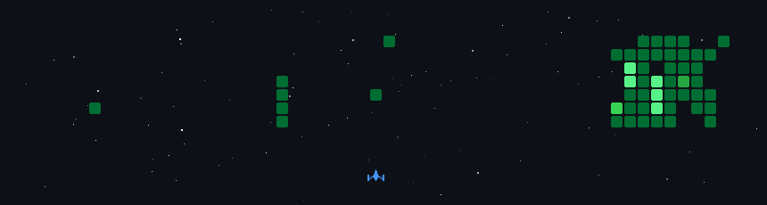

<!--타이틀 부분-->

<!--   -->
<h3>AI Engineer & System Architect</h3>

> "이걸 쓰는 사람은 어떤 경험을 하게 될까?" 
> AI를 단순히 기능으로 붙이는 것이 아니라, 사용자의 맥락 속에서 자연스럽고 의미 있는 경험이 되도록 설계합니다. 
> 구조를 그리고 · 연구로 검증하고 · 시스템으로 만드는 — 그 전체 과정을 설계하는 AI 엔지니어입니다.

 

<!--핵심 역량-->
<h3 align="center">🎯 Core Focus 🎯</h3>

| | |
| :--- | :--- |
| **UX-first AI Design** | FairyRAG · CO-DITOR 등 사용자 맥락 중심 AI 설계 |
| **System Architecture** | Multi-Agent 파이프라인 · State 관리 · Lore Keeper / Co-Author 구조 설계 |
| **Research → Production** | 논문 4편 · KCC 2025 장려상 · HCI Korea 2026 발표 · 실서비스 구현 |

 

<!--Tech Stack-->
<h3 align="center">✨ Tech Stack ✨</h3>

  &nbsp
  &nbsp
  &nbsp
  

 

  &nbsp
  &nbsp
  &nbsp
  

 

<h3 align="center">🤖 LLM / Agent 🤖</h3>

  &nbsp
  &nbsp
  &nbsp
  &nbsp
  

 

  &nbsp
  &nbsp
  &nbsp
  

 

<h3 align="center">☁️ Cloud & Infra ☁️</h3>

  &nbsp
  

 

<h3 align="center">📚 Studying 📚</h3>

  &nbsp
  &nbsp
  

 

<h3 align="center">🛠 Tools 🛠</h3>

  &nbsp
  &nbsp
  &nbsp
  &nbsp
  

 
 

<!--Featured Projects-->
<h3 align="center">💼 Featured Projects 💼</h3>

| 프로젝트 | 설명 | 링크 |
| :--- | :--- | :--- |
| **꿈도깨비** | FairyRAG 논문 기반 대화형 동화 생성 웹 서비스 (팀장 · 백엔드) | [Repo](https://github.com/BookEatingBoogie/main) · [Demo](https://youtu.be/iD2Vp7fY_0E) |
| **SELLON** | 멀티채널 이커머스 셀러 대상 B2B AI SaaS, 이상 감지·CS 분류 에이전트 (조장 · AI 파트 전담) | [Repo](https://github.com/AIVLE-SELLoN) |
| **1형 소아당뇨 예측 시스템** | CGM 데이터 기반 혈당 예측 & 음식 추천 | [Repo](https://github.com/b1ueseoyoung/DBProject) |

 

<!--Research & Awards-->
<h3 align="center">🔬 Research & Awards 🔬</h3>

| 구분 | 내용 |
| :--- | :--- |
| 🏆 **KCC 2025** | 학부생 장려상 — *FairyRAG* |
| 🎤 **HCI Korea 2026** | 구두 발표 — *CO-DITOR* |
| 📄 **논문 4편** | FairyRAG · CO-DITOR · Co-Narrator · PA-RAG |
| 🎓 **연구** | 한성대 컴공 IRIS Lab 산학공동연구 · 학부연구생 (진행 중) |
| 🏫 **교육** | KT AIVLE School 9기 (AI 트랙, 반장) |

 
 

 

<!--Contact-->
<h3 align="center">📫 Contact 📫</h3>

  <a href="https://github.com/b1ueseoyoung">
    &nbsp
  </a>
  <a href="mailto:moosim1120@gmail.com">
    &nbsp
  </a>

<!--  -->
